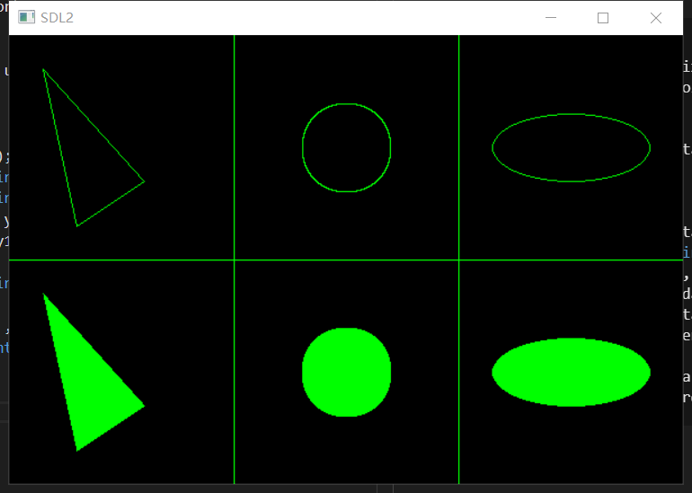

# Hide on Brush
Simple 2D draw api.  

## APIs
```C
/* Initialization */
int HB_SetPixelFunction(HB_PixelFunction pixel);
int HB_SetColorFunction(HB_ColorFunction color);

/* Set Color */
int HB_SetColor(void* userdata, uint8_t red, uint8_t green, uint8_t blue, uint8_t alpha);

/* Draw */
int HB_PutPixel(void* userdata, int x, int y);
int HB_Line(void* userdata, int x1, int y1, int x2, int y2);
int HB_Circle(void* userdata, int x, int y, int r);
int HB_FillCircle(void* userdata, int x, int y, int r);
int HB_Triangle(void* userdata, int x1, int y1, int x2, int y2, int x3, int y3);
int HB_FillTriangle(void* userdata, int x1, int y1, int x2, int y2, int x3, int y3);
int HB_Ellipse(void* userdata, int x , int y , int rx, int ry);
int HB_FillEllipse(void* userdata, int x , int y , int rx, int ry);
```

## Demo by SDL2
* Linux : ``gcc main.c -lSDL2 -lHB -lm``  
* MinGW : ``gcc main.c -lmingw32 -lSDL2main -lSDL2 -lHB``   
```C
#include <SDL2/SDL.h>
#include <HB/brush.h>

/* Wrap SDL2 draw point function */
int plot(void* renderer, int x, int y)
{
	SDL_RenderDrawPoint(renderer, x, y);
}

/* Wrap SDL2 set color function */
int setColor(void* renderer, uint8_t r, uint8_t g, uint8_t b, uint8_t a)
{
	SDL_SetRenderDrawColor(renderer, r, g, b, a);
}


int main(int argc,char* argv[])
{
    SDL_Init(SDL_INIT_EVERYTHING);
    SDL_Window* win = NULL;
    win = SDL_CreateWindow("SDL2",SDL_WINDOWPOS_CENTERED,SDL_WINDOWPOS_CENTERED,
                            600,400,SDL_WINDOW_RESIZABLE);
     
    SDL_Renderer* renderer = NULL;
    renderer = SDL_CreateRenderer(win,-1,SDL_RENDERER_ACCELERATED);
    SDL_RenderClear(renderer);
    
	/*************************************************************/
	/* Init Hide on Brush */
	HB_SetPixelFunction(plot);
	HB_SetColorFunction(setColor);
	
	/* Set Color */
	HB_SetColor(renderer, 0,255,0,0);
	
	/* Draw */
	HB_Line(renderer, 200,000,200,400);
	HB_Line(renderer, 400,000,400,400);
	HB_Line(renderer, 0,200,600,200);
	
	HB_Triangle(renderer, 30,30, 60,170, 120,130);
	HB_FillTriangle(renderer, 30,230, 60,370, 120,330);
	
	HB_Circle(renderer, 300,100, 40);
	HB_FillCircle(renderer, 300,300, 40);
	
	HB_Ellipse(renderer, 500, 100, 70, 30);
	HB_FillEllipse(renderer, 500, 300, 70, 30);
	/*************************************************************/
	
    SDL_RenderPresent(renderer);
 
    SDL_Event e;
    while(1)
    {
        SDL_PollEvent(&e); 
        if(e.type == SDL_QUIT)
        {
            break;
        }
    }
    SDL_DestroyRenderer(renderer);
    SDL_DestroyWindow(win);
    SDL_Quit();
     
    return 0;
}
```


